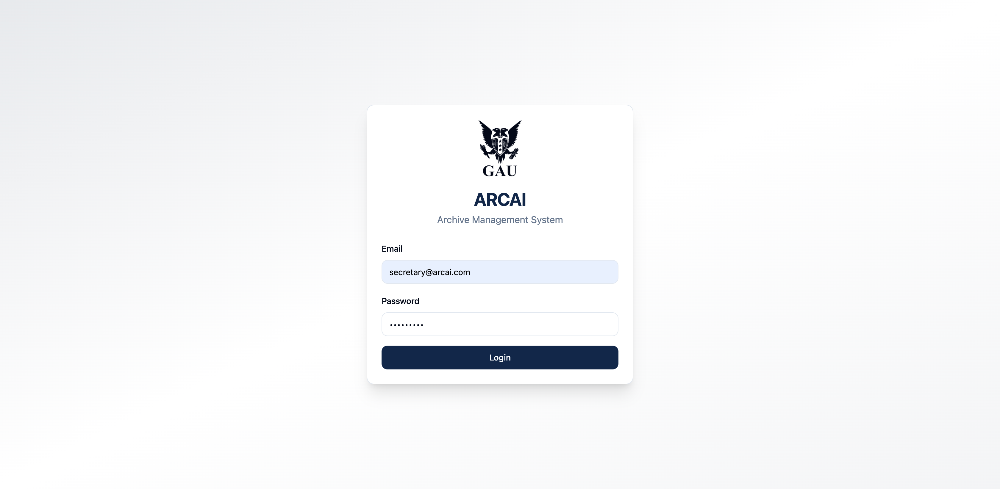
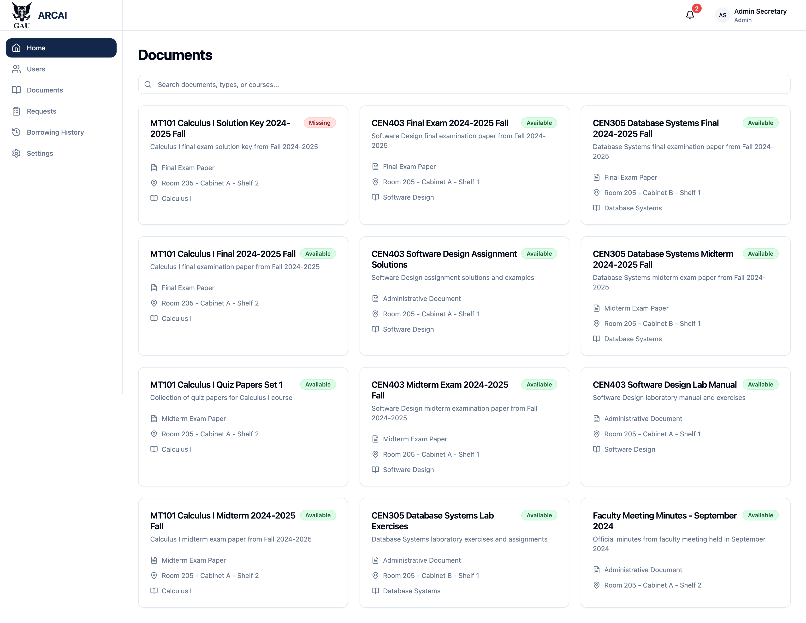
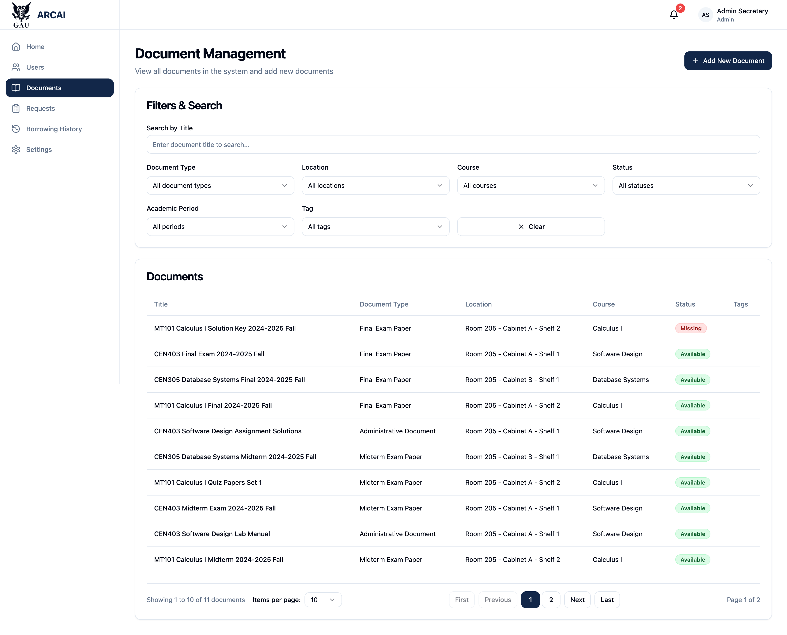
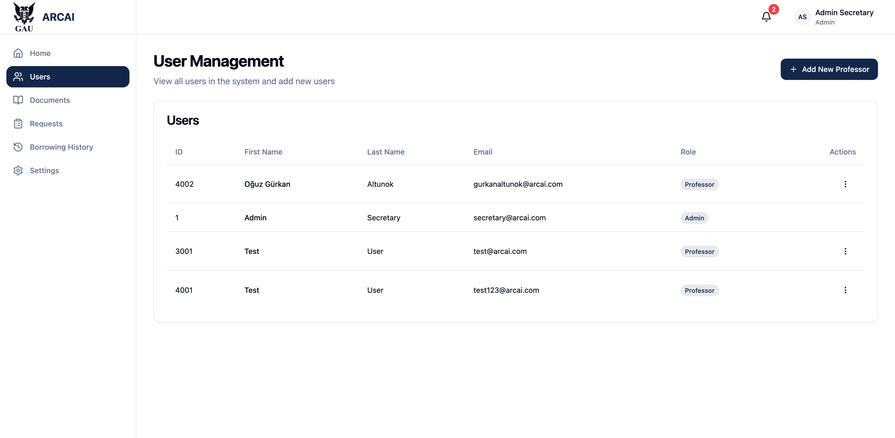
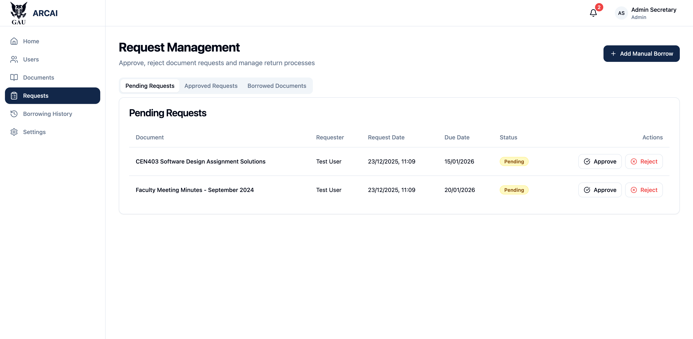
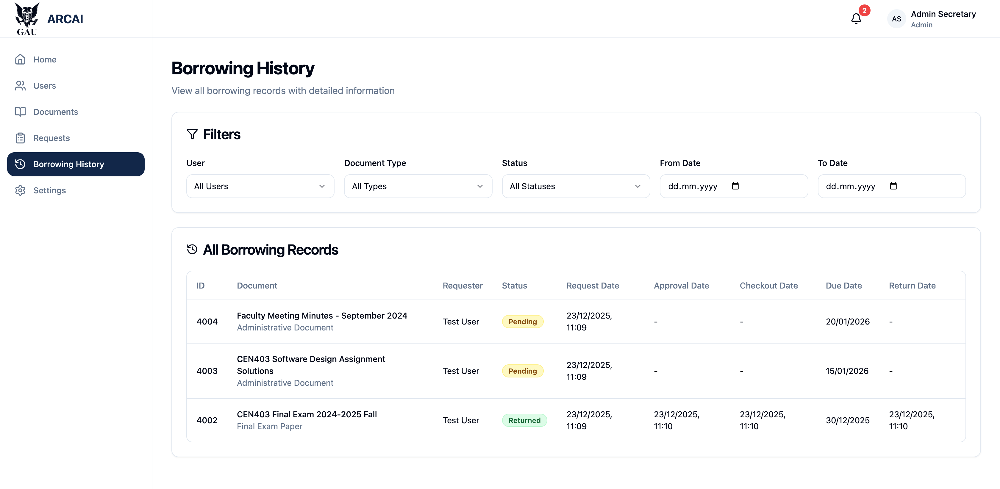
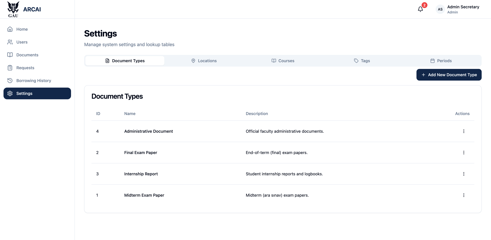
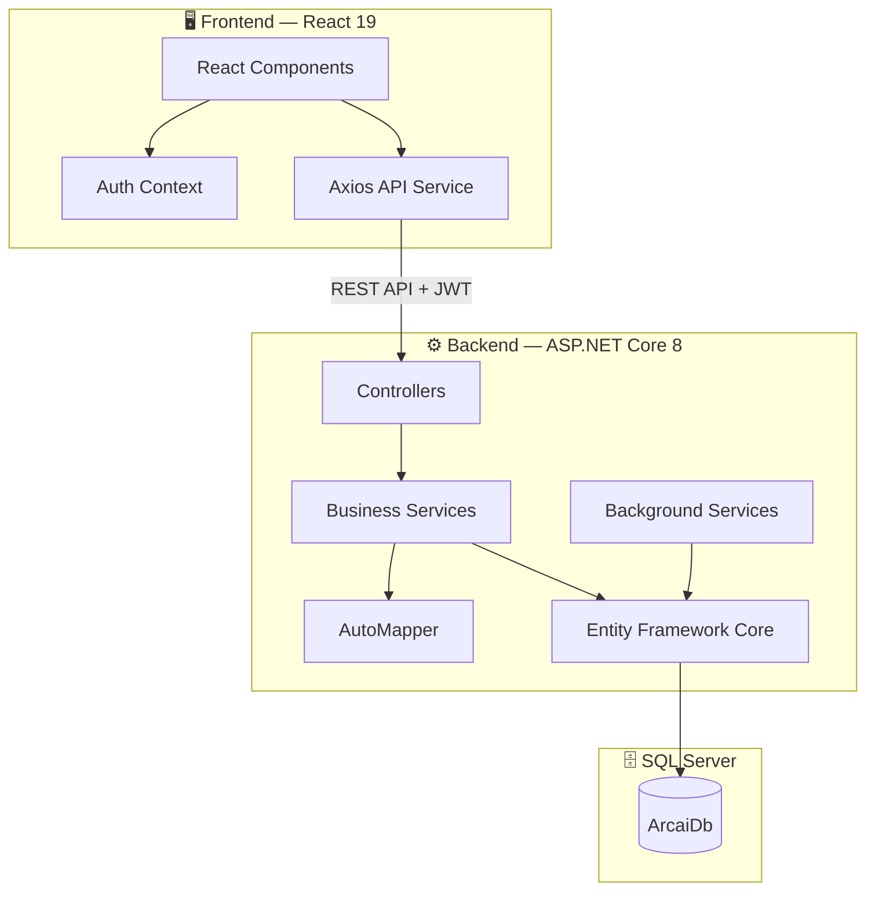
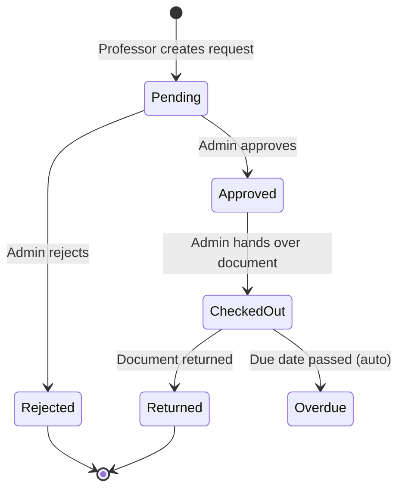

<p align="center">
  
</p>

<h1 align="center">🏛️ ARCAI — Faculty Archive Management System</h1>

<p align="center">
  <strong>A full-stack web application for digitally managing physical archive documents in university faculties.</strong>
</p>

<p align="center">
  
  
  
  
  
  
</p>

<p align="center">
  <a href="#-english">English</a> •
  <a href="#-türkçe">Türkçe</a>
</p>

---

## 🇬🇧 English

### 📖 About

**ARCAI** is a Faculty Archive Management System developed as a university project at **Girne American University (GAU)**, Department of Computer Engineering. The application digitalizes the management of physical archive documents, enabling professors to request documents and secretaries (administrators) to manage the entire borrowing lifecycle efficiently.

### ✨ Key Features

| Feature | Description |
|---------|-------------|
| 🔐 **Authentication & Authorization** | JWT-based login with Role-Based Access Control (Admin / Professor) |
| 📄 **Document Management** | Full CRUD operations with advanced filtering, search, and pagination |
| 📋 **Borrowing System** | Complete workflow: Request → Approve → Checkout → Return |
| 🔔 **Notification System** | Automatic alerts for overdue documents and status updates |
| ⚙️ **Master Data Management** | Manage document types, locations, courses, academic periods, and tags |
| ⏰ **Background Services** | Automated overdue detection running every 24 hours |
| 🔒 **Security** | Password hashing (PBKDF2), soft delete, CORS protection |

### 📸 Screenshots

<details>
<summary><strong>🖼️ Click to view all screenshots</strong></summary>
<br>

#### 🔑 Login Page
<p align="center">
  
</p>

> Clean and modern login interface with the GAU logo. Supports both Admin and Professor roles.

---

#### 🏠 Dashboard — Document Overview
<p align="center">
  
</p>

> Card-based document browsing with real-time status indicators (Available, Missing, Checked Out). Includes quick search functionality.

---

#### 📄 Document Management (Admin)
<p align="center">
  
</p>

> Comprehensive document management with multi-criteria filtering (document type, location, course, status, academic period, tags) and pagination support.

---

#### 👥 User Management (Admin)
<p align="center">
  
</p>

> View and manage all system users. Admins can add new professors and manage existing accounts.

---

#### 📋 Request Management (Admin)
<p align="center">
  
</p>

> Review pending borrowing requests with approve/reject actions. Tab-based navigation between pending, approved, and borrowed documents.

---

#### 📊 Borrowing History
<p align="center">
  
</p>

> Complete audit trail of all borrowing records with detailed date tracking (request, approval, checkout, due, return dates) and filterable views.

---

#### ⚙️ Settings — Master Data
<p align="center">
  
</p>

> Manage system reference data: Document Types, Locations, Courses, Tags, and Academic Periods through an intuitive tabbed interface.

</details>

### 🏗️ Architecture

The project follows a **layered architecture** pattern with clear separation of concerns:

```
ArcaiProject/
│
├── ArcaiProject.Entities/        # Domain Models & Enums
├── ArcaiProject.DataAccess/      # EF Core DbContext & Migrations
├── ArcaiProject.Business/        # Services, DTOs, AutoMapper Profiles
├── ArcaiProject.WebAPI/          # Controllers, Auth, Background Services
│
└── arcai-frontend/               # React 19 + TypeScript SPA
    ├── src/components/           # Reusable UI Components
    ├── src/pages/                # Page Components
    ├── src/services/             # API Communication Layer
    ├── src/context/              # Authentication State (React Context)
    └── src/types/                # TypeScript Type Definitions
```



### 🛠️ Tech Stack

#### Backend
| Technology | Purpose |
|-----------|---------|
| ASP.NET Core 8.0 | RESTful Web API Framework |
| Entity Framework Core 8.0 | ORM (Object-Relational Mapping) |
| Microsoft SQL Server | Relational Database |
| JWT (JSON Web Tokens) | Authentication & Authorization |
| AutoMapper | Object-to-Object Mapping |
| Swagger / OpenAPI | API Documentation & Testing |

#### Frontend
| Technology | Purpose |
|-----------|---------|
| React 19 | UI Library |
| TypeScript | Type-Safe JavaScript |
| React Router v7 | Client-Side Routing |
| Axios | HTTP Client |
| TailwindCSS | Utility-First CSS Framework |
| Material UI (MUI) | Component Library |
| Radix UI | Accessible UI Primitives |

### 🚀 Getting Started

#### Prerequisites

- [.NET 8.0 SDK](https://dotnet.microsoft.com/download/dotnet/8.0)
- [Node.js v18+](https://nodejs.org/)
- [Docker](https://www.docker.com/) (recommended) or SQL Server Express
- [Git](https://git-scm.com/)

#### 1. Clone the Repository

```bash
git clone https://github.com/gurkanaltunok/ArcaiProject.git
cd ArcaiProject
```

#### 2. Database Setup (Docker — Recommended)

```bash
docker run -e "ACCEPT_EULA=Y" \
           -e "SA_PASSWORD=YourStrongPassword123!" \
           -p 1434:1433 \
           -d mcr.microsoft.com/mssql/server:2022-latest
```

#### 3. Configure the Application

Update `ArcaiProject.WebAPI/appsettings.json` with your credentials:

```json
{
  "ConnectionStrings": {
    "DefaultConnection": "Server=localhost,1434;Database=ArcaiDb;User=SA;Password=YourStrongPassword123!;TrustServerCertificate=True"
  },
  "JwtSettings": {
    "Secret": "YourSuperSecretJwtKey_MustBeAtLeast32Characters!",
    "Issuer": "ArcaiAPI",
    "Audience": "ArcaiClient",
    "ExpiryInMinutes": 60
  }
}
```

#### 4. Backend Setup

```bash
# Restore NuGet packages
dotnet restore

# Install EF Core tools (if not installed)
dotnet tool install --global dotnet-ef

# Apply database migrations
cd ArcaiProject.WebAPI
dotnet ef database update --project ../ArcaiProject.DataAccess

# Run the backend
dotnet run
```

> Backend will be available at `http://localhost:5231`  
> Swagger UI: `http://localhost:5231/swagger`

#### 5. Frontend Setup

```bash
# Open a new terminal
cd arcai-frontend

# Install dependencies
npm install

# Start the development server
npm start
```

> Frontend will be available at `http://localhost:3000`

#### 6. Default Accounts

| Role | Email | Password |
|------|-------|----------|
| **Admin** (Secretary) | `secretary@arcai.com` | `AdminPassword123!` |
| **Professor** | `ibrahim.ersan@arcai.com` | `ProfessorPassword123!` |

### 📡 API Endpoints

<details>
<summary><strong>View all API endpoints</strong></summary>

#### Authentication
| Method | Endpoint | Description |
|--------|----------|-------------|
| `POST` | `/api/auth/login` | User login (returns JWT) |
| `GET` | `/api/auth/me` | Get current user info |

#### Documents
| Method | Endpoint | Description | Access |
|--------|----------|-------------|--------|
| `GET` | `/api/documents` | List documents (paginated + filtered) | All |
| `GET` | `/api/documents/{id}` | Get document by ID | All |
| `POST` | `/api/documents` | Create document | Admin |
| `PUT` | `/api/documents/{id}` | Update document | Admin |
| `DELETE` | `/api/documents/{id}` | Soft delete document | Admin |

#### Borrowing
| Method | Endpoint | Description | Access |
|--------|----------|-------------|--------|
| `POST` | `/api/borrowing/request` | Create borrow request | Professor |
| `GET` | `/api/borrowing/my-requests` | Get own requests | Professor |
| `GET` | `/api/borrowing/pending` | Get pending requests | Admin |
| `POST` | `/api/borrowing/{id}/approve` | Approve request | Admin |
| `POST` | `/api/borrowing/{id}/reject` | Reject request | Admin |
| `POST` | `/api/borrowing/{id}/checkout` | Mark as checked out | Admin |
| `POST` | `/api/borrowing/{id}/return` | Mark as returned | Admin |
| `GET` | `/api/borrowing/all` | Get all records | Admin |

#### Master Data
| Method | Endpoint | Description |
|--------|----------|-------------|
| `GET` | `/api/documenttypes` | Get document types |
| `GET` | `/api/locations` | Get locations |
| `GET` | `/api/courses` | Get courses |
| `GET` | `/api/academicperiods` | Get academic periods |
| `GET` | `/api/tags` | Get tags |
| `GET` | `/api/users` | Get all users (Admin) |

#### Notifications
| Method | Endpoint | Description |
|--------|----------|-------------|
| `GET` | `/api/notifications` | Get user notifications |
| `PUT` | `/api/notifications/{id}/read` | Mark as read |

</details>

### 🔄 Borrowing Workflow



### 📝 License

This project is licensed under **All Rights Reserved** — see the [LICENSE](LICENSE) file for details. This repository is made publicly available for educational and portfolio purposes only.

### 👤 Author

**Oğuz Gürkan ALTUNOK**  
📚 Computer Engineering — Girne American University (GAU)  
📧 Contact: [GitHub Profile](https://github.com/gurkanaltunok)

---

## 🇹🇷 Türkçe

### 📖 Hakkında

**ARCAI**, **Girne Amerikan Üniversitesi (GAÜ)** Bilgisayar Mühendisliği bölümünde üniversite projesi olarak geliştirilen bir Fakülte Arşiv Yönetim Sistemidir. Uygulama, fiziksel arşiv belgelerinin yönetimini dijitalleştirerek profesörlerin belge talep etmesini ve sekreterlerin (yöneticilerin) tüm ödünç alma sürecini verimli bir şekilde yönetmesini sağlar.

### ✨ Temel Özellikler

| Özellik | Açıklama |
|---------|----------|
| 🔐 **Kimlik Doğrulama ve Yetkilendirme** | JWT tabanlı giriş, Rol Tabanlı Erişim Kontrolü (Admin / Profesör) |
| 📄 **Belge Yönetimi** | Gelişmiş filtreleme, arama ve sayfalama ile tam CRUD işlemleri |
| 📋 **Ödünç Alma Sistemi** | Eksiksiz iş akışı: Talep → Onay → Teslim → İade |
| 🔔 **Bildirim Sistemi** | Gecikmiş belgeler ve durum güncellemeleri için otomatik uyarılar |
| ⚙️ **Ana Veri Yönetimi** | Belge türleri, konumlar, dersler, akademik dönemler ve etiketleri yönetme |
| ⏰ **Arka Plan Servisleri** | Her 24 saatte bir çalışan otomatik gecikme tespiti |
| 🔒 **Güvenlik** | Şifre hashleme (PBKDF2), yumuşak silme, CORS koruması |

### 📸 Ekran Görüntüleri

<details>
<summary><strong>🖼️ Tüm ekran görüntülerini görmek için tıklayın</strong></summary>
<br>

#### 🔑 Giriş Sayfası
<p align="center">
  
</p>

> GAU logosu ile temiz ve modern giriş arayüzü. Hem Admin hem Profesör rolleri desteklenir.

---

#### 🏠 Ana Sayfa — Belge Genel Görünümü
<p align="center">
  
</p>

> Gerçek zamanlı durum göstergeleri (Mevcut, Kayıp, Ödünçte) ile kart tabanlı belge tarama. Hızlı arama özelliği içerir.

---

#### 📄 Belge Yönetimi (Admin)
<p align="center">
  
</p>

> Çoklu kriter filtreleme (belge türü, konum, ders, durum, akademik dönem, etiketler) ve sayfalama desteği ile kapsamlı belge yönetimi.

---

#### 👥 Kullanıcı Yönetimi (Admin)
<p align="center">
  
</p>

> Tüm sistem kullanıcılarını görüntüleme ve yönetme. Adminler yeni profesörler ekleyebilir ve mevcut hesapları yönetebilir.

---

#### 📋 Talep Yönetimi (Admin)
<p align="center">
  
</p>

> Onay/red aksiyonları ile bekleyen ödünç alma taleplerini inceleme. Bekleyen, onaylanan ve ödünç alınan belgeler arasında sekme tabanlı gezinme.

---

#### 📊 Ödünç Alma Geçmişi
<p align="center">
  
</p>

> Tüm ödünç alma kayıtlarının detaylı tarih takibi (talep, onay, teslim, son tarih, iade tarihleri) ve filtrelenebilir görünümler ile eksiksiz denetim izi.

---

#### ⚙️ Ayarlar — Ana Veriler
<p align="center">
  
</p>

> Sezgisel sekmeli arayüz ile sistem referans verilerini yönetin: Belge Türleri, Konumlar, Dersler, Etiketler ve Akademik Dönemler.

</details>

### 🏗️ Mimari

Proje, endişelerin net bir şekilde ayrılması ile **katmanlı mimari** desenini takip eder:

```
ArcaiProject/
│
├── ArcaiProject.Entities/        # Domain Modelleri & Enum'lar
├── ArcaiProject.DataAccess/      # EF Core DbContext & Migration'lar
├── ArcaiProject.Business/        # Servisler, DTO'lar, AutoMapper Profilleri
├── ArcaiProject.WebAPI/          # Controller'lar, Auth, Arka Plan Servisleri
│
└── arcai-frontend/               # React 19 + TypeScript SPA
    ├── src/components/           # Yeniden Kullanılabilir UI Bileşenleri
    ├── src/pages/                # Sayfa Bileşenleri
    ├── src/services/             # API İletişim Katmanı
    ├── src/context/              # Kimlik Doğrulama State (React Context)
    └── src/types/                # TypeScript Tip Tanımları
```

### 🛠️ Teknoloji Yığını

#### Backend
| Teknoloji | Amaç |
|-----------|------|
| ASP.NET Core 8.0 | RESTful Web API Framework |
| Entity Framework Core 8.0 | ORM (Nesne-İlişkisel Eşleme) |
| Microsoft SQL Server | İlişkisel Veritabanı |
| JWT (JSON Web Tokens) | Kimlik Doğrulama ve Yetkilendirme |
| AutoMapper | Nesneden Nesneye Eşleme |
| Swagger / OpenAPI | API Dokümantasyonu ve Test |

#### Frontend
| Teknoloji | Amaç |
|-----------|------|
| React 19 | UI Kütüphanesi |
| TypeScript | Tip Güvenli JavaScript |
| React Router v7 | İstemci Tarafı Yönlendirme |
| Axios | HTTP İstemcisi |
| TailwindCSS | Utility-First CSS Framework |
| Material UI (MUI) | Bileşen Kütüphanesi |
| Radix UI | Erişilebilir UI Temel Bileşenleri |

### 🚀 Başlarken

#### Gereksinimler

- [.NET 8.0 SDK](https://dotnet.microsoft.com/download/dotnet/8.0)
- [Node.js v18+](https://nodejs.org/)
- [Docker](https://www.docker.com/) (önerilen) veya SQL Server Express
- [Git](https://git-scm.com/)

#### 1. Depoyu Klonlayın

```bash
git clone https://github.com/gurkanaltunok/ArcaiProject.git
cd ArcaiProject
```

#### 2. Veritabanı Kurulumu (Docker — Önerilen)

```bash
docker run -e "ACCEPT_EULA=Y" \
           -e "SA_PASSWORD=GucluSifreniz123!" \
           -p 1434:1433 \
           -d mcr.microsoft.com/mssql/server:2022-latest
```

#### 3. Uygulamayı Yapılandırın

`ArcaiProject.WebAPI/appsettings.json` dosyasını kendi bilgilerinizle güncelleyin:

```json
{
  "ConnectionStrings": {
    "DefaultConnection": "Server=localhost,1434;Database=ArcaiDb;User=SA;Password=GucluSifreniz123!;TrustServerCertificate=True"
  },
  "JwtSettings": {
    "Secret": "SuperGizliJwtAnahtariniz_EnAz32KarakterOlmali!",
    "Issuer": "ArcaiAPI",
    "Audience": "ArcaiClient",
    "ExpiryInMinutes": 60
  }
}
```

#### 4. Backend Kurulumu

```bash
# NuGet paketlerini geri yükle
dotnet restore

# EF Core araçlarını yükle (kurulu değilse)
dotnet tool install --global dotnet-ef

# Veritabanı migration'larını uygula
cd ArcaiProject.WebAPI
dotnet ef database update --project ../ArcaiProject.DataAccess

# Backend'i çalıştır
dotnet run
```

> Backend `http://localhost:5231` adresinde erişilebilir olacaktır  
> Swagger UI: `http://localhost:5231/swagger`

#### 5. Frontend Kurulumu

```bash
# Yeni bir terminal açın
cd arcai-frontend

# Bağımlılıkları yükle
npm install

# Geliştirme sunucusunu başlat
npm start
```

> Frontend `http://localhost:3000` adresinde erişilebilir olacaktır

#### 6. Varsayılan Hesaplar

| Rol | E-posta | Şifre |
|-----|---------|-------|
| **Admin** (Sekreter) | `secretary@arcai.com` | `AdminPassword123!` |
| **Profesör** | `ibrahim.ersan@arcai.com` | `ProfessorPassword123!` |

### 🔄 Ödünç Alma İş Akışı

```
Beklemede → Onaylandı (Admin onaylar)
Beklemede → Reddedildi (Admin reddeder)
Onaylandı → Teslim Edildi (Admin belgeyi teslim eder)
Teslim Edildi → İade Edildi (Belge iade edilir)
Teslim Edildi → Gecikmiş (Son tarih geçti — otomatik)
```

### 📝 Lisans

Bu proje **Tüm Hakları Saklıdır** lisansı ile lisanslanmıştır — detaylar için [LICENSE](LICENSE) dosyasına bakınız. Bu depo yalnızca eğitim ve portfolyo amaçlı olarak herkese açık paylaşılmıştır.

### 👤 Geliştirici

**Oğuz Gürkan ALTUNOK**  
📚 Bilgisayar Mühendisliği — Girne Amerikan Üniversitesi (GAÜ)  
📧 İletişim: [GitHub Profili](https://github.com/gurkanaltunok)

---

<p align="center">
  <sub>Girne Amerikan Üniversitesi (GAÜ) — Bilgisayar Mühendisliği Bölümü — 2024/2025</sub>
</p>
